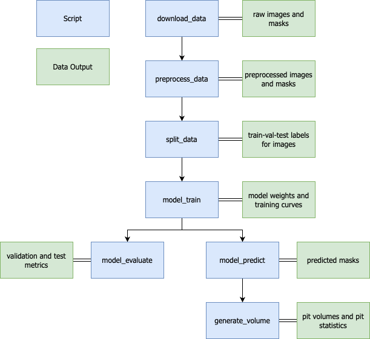

# xct-aluminum-bondwire-corrosion

## Automated Image Segmentation and Processing Pipeline Applied to X-ray Computed Tomography Studies of Pitting Corrosion in Aluminum Wires

This is the official repository for "Automated Image Segmentation and Processing Pipeline Applied to X-ray Computed Tomography Studies of Pitting Corrosion in Aluminum Wires".
This respository contains the code and pipeline necessary to reproduce the work from this paper or to apply the approach to your own dataset.

## Repository Design

This repository is designed around a single configuration file for ease of use. The `/src/config.py` contains arguments that can be changed to adjust data and model parameters.
This includes things such as the directory the data is downloaded into, the type of train-val-test split used, and model hyperparameters.
All adjustments should be made here in order to tailor the pipeline to a user's specific needs.

Here is a diagram depicting the order in which scripts should be run to generate the input dependencies for other scripts.



Notes:
- `preprocess_data.py` is tailored for this specific image set. Using different images would require either not using this or writing a custom preprocessing pipeline
- The configuration file defaults to the parameters used for the best performing model reported in the paper.

## Downloading Data

The dataset can be downloaded by running the `/src/data_download.py` file.
This script downloads the image and mask files from an OSF.io project hosted at: https://osf.io/k27v4/.
All downloads will be placed in `/data/raw`.
From here the `/src/preprocess_data.py` script can be run to preprocess the image and masks as described in the paper for the deep learning pipeline.
The preprocessed versions will be placed in `/data/preprocessed`.
Alternative preprocessing techniques can be used if desired.

The model training scripts operate under the assumption the directory is structured as such:

```
xct-aluminum-bondwire-corrosion
├── data
│   ├── processed
│   │   ├── images
│   │   └── masks
│   └── raw
│       ├── images
│       └── masks
```

These directories can easily be changed by adjusting the paths inside the `/src/config.py` file.

## Model Training and Evaluation

A model can be trained on the preprocessed data using the `/src/model_train.py` file.
This will train a segmentation model using the given parameters from the configuration file.
Models trained in the paper: 'vgg-19', 'resnet50', 'seresnext101', and None (which corresponds to a base U-Net)

After training, `/src/model_evaluate.py` can be run to gather performance metrics on the validation and test set.

## Volume Construction and Analysis

`/src/model_predict.py` generates predictions for all images residing in the `/data/preprocessed` directory.
`/src/generate_volume.py` combines predictions into pit volumes and gathers statistics on the dimensions and properties of all pits.
